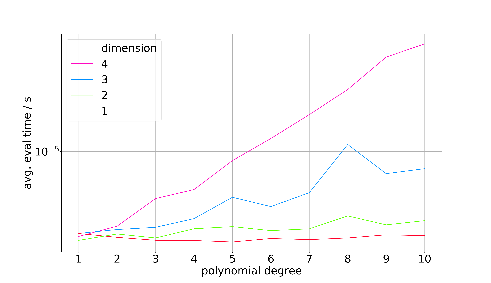
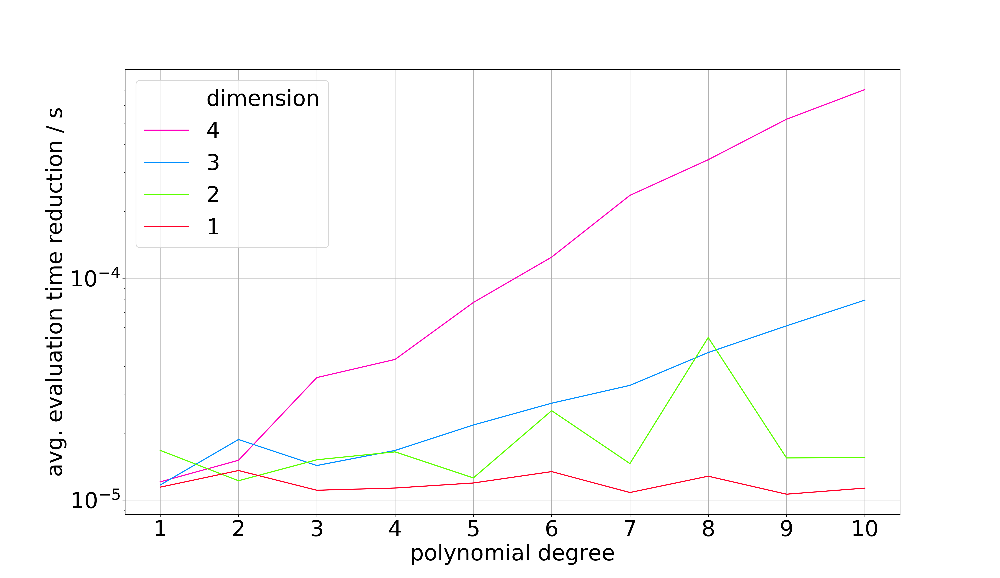
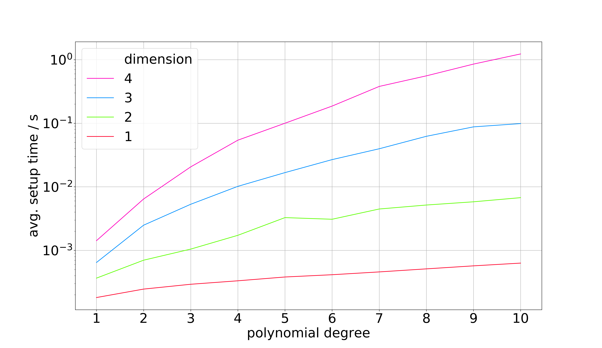
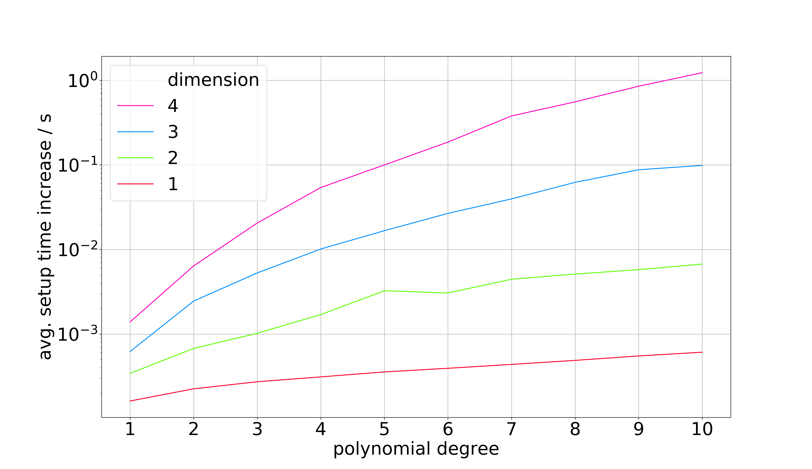

===============
multivar_horner
===============

.. image:: https://travis-ci.org/MrMinimal64/multivar_horner.svg?branch=master
    :target: https://travis-ci.org/MrMinimal64/multivar_horner

.. image:: https://img.shields.io/pypi/wheel/multivar-horner.svg
    :target: https://pypi.python.org/pypi/multivar-horner

.. image:: https://pepy.tech/badge/multivar-horner
    :alt: Total PyPI downloads
    :target: https://pypi.python.org/pypi/multivar-horner

.. image:: https://img.shields.io/pypi/v/multivar_horner.svg
    :alt: latest version on PyPI
    :target: https://pypi.python.org/pypi/multivar-horner

A python package implementing a multivariate `horner scheme ("Horner's method", "Horner's rule") <https://en.wikipedia.org/wiki/Horner%27s_method>`__  for efficiently evaluating multivariate polynomials.

A polynomial is being factorised according to the greedy heuristic described in [1], with some additional computational tweaks.
The resulting Horner factorisation requires less operations for evaluation.
The factorisation is computed by growing a "Horner Factorisation Tree".
When the polynomial is fully factorized (= all leaves cannot be factorised any more), a computational "recipe" for evaluating the polynomial is being compiled.
This "recipe" (stored internally as numpy arrays) enables fast evaluation with minimal memory requirement, because of the lack of additional overhead of recursive function calls (traversing the tree) and functions precompiled by ``numba`` operating on numpy arrays.

All factors in use in the factorisation are computed only once and factorized themselves (=reusing computed values) to save computations.

**Pros:**
 * near to minimal representation of a multivariate polynomial (in the sense of memory and time complexity of the evaluation).
 * less roundoff errors[3], [4]
 * lower error propagation, because of fewer operations [1, Ch. 5]

**Cons:**
 * increased initial computational requirements and memory to find and then store the factorisation (cf. speed test results below).

For an exact evaluation of the impact of computing Horner factorisations see the benchmarks below.
It is also possible to search for an optimal factorisation (cf. section "Optimal Horner Factorisation")

Also see:
`GitHub <https://github.com/MrMinimal64/multivar_horner>`__,
`PyPI <https://pypi.python.org/pypi/multivar_horner/>`__

Dependencies
============

(``python3``),
``numpy``,
``Numba``

Installation
============

Installation with pip:

::

    pip install multivar_horner

Usage
=====

Check this code in ``example.py``:

.. code-block:: python

    import numpy as np
    from multivar_horner.multivar_horner import MultivarPolynomial, HornerMultivarPolynomial

    # input parameters defining the polynomial
    #   p(x) = 5.0 + 1.0 x_1^3 x_2^1 + 2.0 x_1^2 x_3^1 + 3.0 x_1^1 x_2^1 x_3^1
    #   with...
    #       dimension N = 3
    #       amount of monomials M = 4
    #       max_degree D = 3
    # NOTE: these data types and shapes are required by the precompiled functions in helper_fcts_numba.py
    coefficients = np.array([[5.0], [1.0], [2.0], [3.0]], dtype=np.float64)  # column numpy vector = (M,1)-matrix
    exponents = np.array([[0, 0, 0], [3, 1, 0], [2, 0, 1], [1, 1, 1]], dtype=np.uint32)  # numpy (M,N)-matrix

    # represent the polynomial in the regular, naive form without any factorisation (simply stores the matrices)
    polynomial = MultivarPolynomial(coefficients, exponents)

    # visualising the used polynomial representation
    print(polynomial)
    # [#ops=27] p(x) = 5.0 x_1^0 x_2^0 x_3^0 + 1.0 x_1^3 x_2^1 x_3^0 + 2.0 x_1^2 x_2^0 x_3^1 + 3.0 x_1^1 x_2^1 x_3^1
    # NOTE: the number in square brackets indicates the number of operations required
    #   to evaluate the polynomial (ADD, MUL, POW).
    # NOTE: in the case of unfactorised polynomials many unnecessary operations are being done
    # (internally uses numpy matrix operations)

    # define a query point and evaluate the polynomial
    x = np.array([-2.0, 3.0, 1.0], dtype=np.float64)  # numpy row vector (1,N)
    p_x = polynomial.eval(x)
    print(p_x)  # -29.0

    # represent the polynomial in factorised form:
    # uses the heuristic proposed in [1]: iteratively factors out the factor with the highest usage
    # pass compute_representation=True in order to compile a string representation of the factorisation
    # pass keep_tree=True when the factorisation tree should be kept after the factorisation process
    horner_polynomial = HornerMultivarPolynomial(coefficients, exponents, compute_representation=True)
    print(horner_polynomial)  # [#ops=10] p(x) = x_1 (x_1 (x_1 (c x_2) + c x_3) + c x_2 x_3) + c

    # pass rectify_input=True to automatically try converting the input to the required numpy data structures
    # pass validate_input=True to check if input data is valid (e.g. only non negative exponents)
    # NOTE: the default for both options is false (increased speed)
    coefficients = [5.0, 1.0, 2.0, 3.0]  # must not be a column vector, but dimensions must still fit
    exponents = [[0, 0, 0], [3, 1, 0], [2, 0, 1], [1, 1, 1]]
    horner_polynomial = HornerMultivarPolynomial(coefficients, exponents, rectify_input=True, validate_input=True)

    p_x = horner_polynomial.eval(x)
    print(p_x)  # -29.0

    # export the factorised polynomial
    path = 'file_name.pickle'
    horner_polynomial.export_pickle(path=path)

    from multivar_horner.multivar_horner import load_pickle

    # import a polynomial
    horner_polynomial = load_pickle(path)
    p_x = horner_polynomial.eval(x)
    print(p_x)  # -29.0

    # BETA:
    # pass find_optimal=True to start an adapted A* search through all possible factorisations
    # theoretically guaranteed to find the optimal solution
    # NOTE: time and memory consumption is MUCH higher! cf. Readme: "Optimal Horner Factorisation"
    horner_polynomial_optimal = HornerMultivarPolynomial(coefficients, exponents, find_optimal=True,
                                                         compute_representation=True)
    print(horner_polynomial_optimal)  # [#ops=10] p(x) = x_3 (x_1 (c x_1 + c x_2)) + c + c x_1^3 x_2

    # BETA: untested features
    # derivative and gradient of a polynomial
    # NOTE: partial derivatives themselves will be instances of the same parent class
    deriv_2 = horner_polynomial.get_partial_derivative(2)

    grad = horner_polynomial.get_gradient()

Benchmarks
==================

The benchmarks have been performed on a 15-inch MacBook Pro from 2017 with a 4 core 2,8 GHz Intel Core i7 processor, 16 GB 2133 MHz LPDDR3 RAM and macOS 10.13 High Sierra.
The software versions in use were Python 3.7, numpy 1.16.3 and numba 0.40.

::

    Speed test:
    testing 200 evenly distributed random polynomials
    average timings per polynomial:

     parameters   |  setup time (/s)                        |  eval time (/s)                      |  # operations                        | lucrative after
    dim | max_deg | naive      | Horner     | delta         | naive      | Horner     | delta      | naive      | Horner     | delta      |    # evals
    ================================================================================================================================================================
    1   | 1       | 1.895e-05  | 0.0001675  | 7.8 x more    | 1.62e-05   | 2.155e-06  | 6.5 x less | 3          | 1          | 2.0 x less | 11
    1   | 2       | 2.041e-05  | 0.0002327  | 10 x more     | 1.384e-05  | 2.461e-06  | 4.6 x less | 5          | 3          | 0.7 x less | 19
    1   | 3       | 2.005e-05  | 0.000294   | 14 x more     | 1.495e-05  | 2.525e-06  | 4.9 x less | 7          | 4          | 0.8 x less | 22
    1   | 4       | 2.045e-05  | 0.0003652  | 17 x more     | 1.513e-05  | 2.658e-06  | 4.7 x less | 8          | 5          | 0.6 x less | 28
    1   | 5       | 2.081e-05  | 0.0004009  | 18 x more     | 1.473e-05  | 2.365e-06  | 5.2 x less | 10         | 6          | 0.7 x less | 31

    2   | 1       | 2.077e-05  | 0.0003436  | 16 x more     | 1.413e-05  | 2.956e-06  | 3.8 x less | 11         | 3          | 2.7 x less | 29
    2   | 2       | 2.183e-05  | 0.0006544  | 29 x more     | 1.759e-05  | 2.791e-06  | 5.3 x less | 23         | 9          | 1.6 x less | 43
    2   | 3       | 2.309e-05  | 0.001198   | 51 x more     | 1.566e-05  | 2.67e-06   | 4.9 x less | 43         | 18         | 1.4 x less | 90
    2   | 4       | 2.27e-05   | 0.001749   | 76 x more     | 1.645e-05  | 2.736e-06  | 5.0 x less | 66         | 28         | 1.4 x less | 126
    2   | 5       | 2.655e-05  | 0.002581   | 96 x more     | 1.699e-05  | 3.047e-06  | 4.6 x less | 98         | 42         | 1.3 x less | 183

    3   | 1       | 2.297e-05  | 0.0007024  | 30 x more     | 1.66e-05   | 2.658e-06  | 5.2 x less | 30         | 8          | 2.8 x less | 49
    3   | 2       | 2.19e-05   | 0.002274   | 103 x more    | 1.669e-05  | 3.336e-06  | 4.0 x less | 102        | 30         | 2.4 x less | 169
    3   | 3       | 2.379e-05  | 0.004855   | 203 x more    | 1.768e-05  | 2.86e-06   | 5.2 x less | 222        | 68         | 2.3 x less | 326
    3   | 4       | 2.451e-05  | 0.009766   | 397 x more    | 2.198e-05  | 3.783e-06  | 4.8 x less | 447        | 137        | 2.3 x less | 535
    3   | 5       | 2.721e-05  | 0.01648    | 604 x more    | 2.466e-05  | 3.529e-06  | 6.0 x less | 763        | 233        | 2.3 x less | 779

    4   | 1       | 2.296e-05  | 0.001601   | 69 x more     | 1.597e-05  | 2.802e-06  | 4.7 x less | 79         | 17         | 3.6 x less | 120
    4   | 2       | 2.27e-05   | 0.007437   | 327 x more    | 1.996e-05  | 3.723e-06  | 4.4 x less | 382        | 89         | 3.3 x less | 457
    4   | 3       | 2.834e-05  | 0.02269    | 800 x more    | 3.023e-05  | 3.931e-06  | 6.7 x less | 1181       | 279        | 3.2 x less | 862
    4   | 4       | 3.638e-05  | 0.05136    | 1410 x more   | 4.494e-05  | 5.186e-06  | 7.7 x less | 2667       | 632        | 3.2 x less | 1291
    4   | 5       | 5.207e-05  | 0.1111     | 2132 x more   | 8.537e-05  | 7.524e-06  | 10 x less  | 5758       | 1359       | 3.2 x less | 1426

    5   | 1       | 2.553e-05  | 0.00305    | 118 x more    | 1.652e-05  | 3.533e-06  | 3.7 x less | 167        | 31         | 4.4 x less | 233
    5   | 2       | 2.956e-05  | 0.02257    | 763 x more    | 2.941e-05  | 4.167e-06  | 6.1 x less | 1270       | 246        | 4.2 x less | 893
    5   | 3       | 4.702e-05  | 0.101      | 2147 x more   | 7.98e-05   | 6.612e-06  | 11 x less  | 5605       | 1083       | 4.2 x less | 1379
    5   | 4       | 0.0001021  | 0.335      | 3278 x more   | 0.000236   | 1.579e-05  | 14 x less  | 18399      | 3521       | 4.2 x less | 1521
    5   | 5       | 0.0001861  | 0.759      | 4076 x more   | 0.0004799  | 3.037e-05  | 15 x less  | 40980      | 7885       | 4.2 x less | 1688

Average evaluation time per polynomial using Horner factorisation

Average evaluation time decrease per polynomial using Horner factorisation in comparison to the naive matrix representation

Average setup time per polynomial for computing the Horner factorisation

Average setup time increase per polynomial for computing the Horner factorisation in comparison to the naive matrix representation

Optimal Horner Factorisation
============================

When passing ``find_optimal=True`` this package allows searching for an optimal factorisation:

.. code-block:: python

    horner_polynomial_optimal = HornerMultivarPolynomial(coefficients, exponents, find_optimal=True)

**Basic idea**:

Instead of using a heuristic to choose the next factor one can allow a search over all possible (meaningful) factorisations in order to arrive at a minimal Horner factorisation.
The amount of possible factorisations however is increasing exponentially with the degree of a polynomial and its amount of monomials.
One possibility to avoid computing each factorisation is to employ a version of A*-search adapted for factorisation trees:
• Initialise a set of all meaningful possible first level Newton factorisations
• Rank all factorisation according to a lower bound (“heuristic”) of their lowest possible amount of operations
• Iteratively factorise the most promising factorisation and update the heuristic
• Stop when the most promising factorisation is fully factorised

This approach is guaranteed to yield a minimal Horner factorisation, but its performance highly depends on the heuristic in use: Irrelevant factorisations are only being ignored if the heuristic is not too optimistic in estimating the amount of operations. On the other hand the heuristic must be easy to compute, because it would otherwise be computationally cheaper to just try all different factorisations.
Even though it missing to cover exponentiations, the branch-and-bound method suggested in [2, ch. 3.1] is almost identical to this procedure.

Even with a good heuristic this method is only traceable for small polynomials because of its increased resource requirements.
Since experiments show that factorisations obtained by choosing one factorisation according to a heuristic have the same or only a slightly higher amount of included operations[2, ch. 7], the computational effort of this approach is not justifiable in most cases.
A use case however is to compute and store a minimal representation of a polynomial in advance if possible.

**NOTES:**

* currently this approach seems to actually try all possible factorisations, because the heuristic in use is too optimistic (= brute force, improvements needed)
* This requires MUCH more memory and computing time than just trying one factorisation (the number of possible factorisations is growing exponentially with the size of the polynomial!).
* in the first test runs the results seemed to be identical (in terms of #ops) with the vanilla approach of just trying one factorisation!
* one could easily adapt this approach to find all optimal Horner factorisations
* in contrary to univariate polynomials there are possibly many optimal Horner factorisations of a multivariate polynomial. Even an optimal Horner factorisation must not be the globally minimal representation (other types factorisations possible: e.g. "algebraic factorisation", "common subexpression elimination")!

Contact
=======

Tell me if and how your are using this package. This encourages me to develop and test it further.

Most certainly there is stuff I missed, things I could have optimized even further or explained more clearly, etc.
I would be really glad to get some feedback.

If you encounter any bugs, have suggestions etc.
do not hesitate to **open an Issue** or **add a Pull Requests** on Git.

License
=======

``multivar_horner`` is distributed under the terms of the MIT license
(see LICENSE.txt).

References
==========

[1] M. Ceberio and V. Kreinovich, `"Greedy Algorithms for Optimizing Multivariate Horner Schemes" <http://citeseerx.ist.psu.edu/viewdoc/download?doi=10.1.1.330.7430&rep=rep1&type=pdf>`__. ACM SIGSAM Bulletin, 2004, 38. Jg., Nr. 1, S. 8-15.

[2] M. Kojima, `“Efficient evaluation of polynomials and their partial derivatives in homotopy continuation methods” <https://pdfs.semanticscholar.org/db75/5d4f4127e43c0c81884fe2b1c8c48d292ccf.pdf>`__, Journal of the Operations Research Society of Japan, vol. 51, no. 1, pp. 29–54, 2008.

[3] J. M. Peña and T. Sauer, “On the multivariate Horner scheme”, SIAM journal on numerical analysis, vol. 37, no. 4, pp. 1186–1197, 2000.

[4] J. M. Peña and T. Sauer, “On the multivariate Horner scheme II: Running error analysis”, Computing, vol. 65, no. 4, pp. 313–322, 2000.
