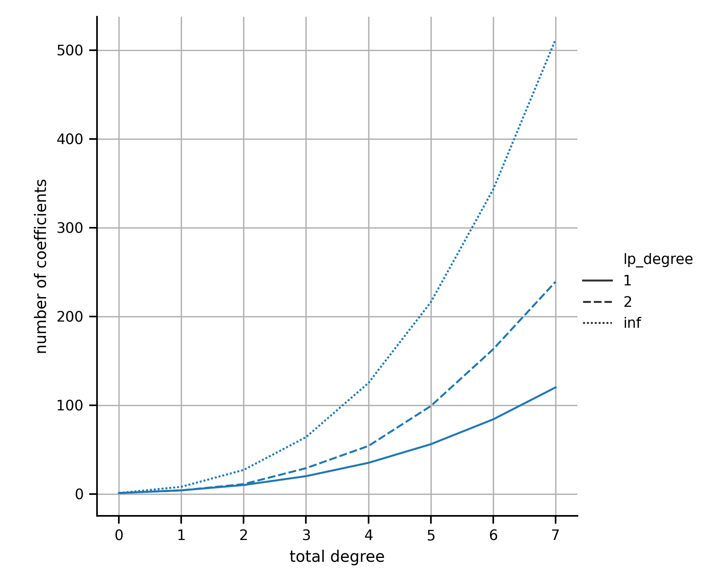
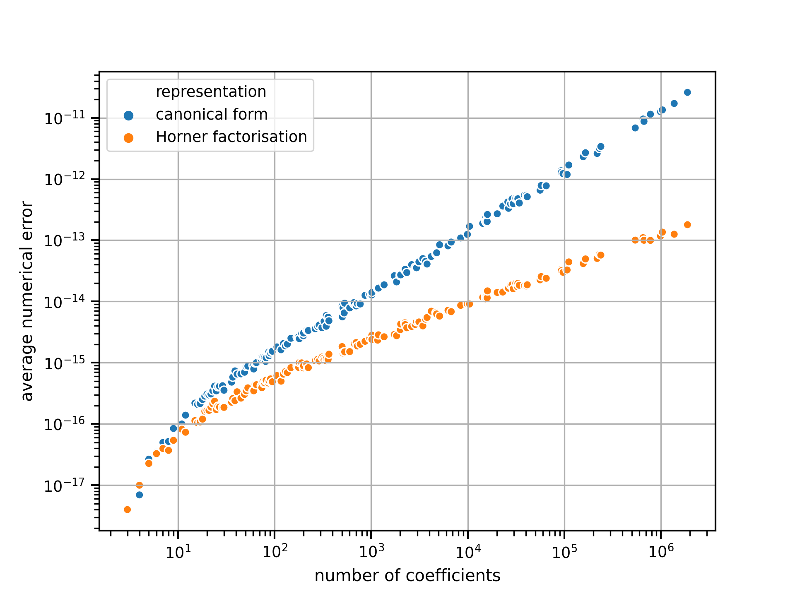
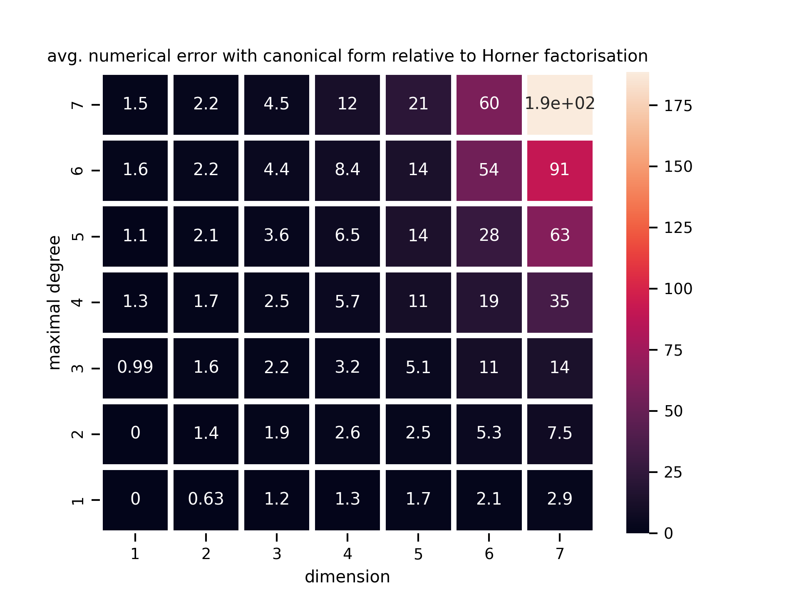
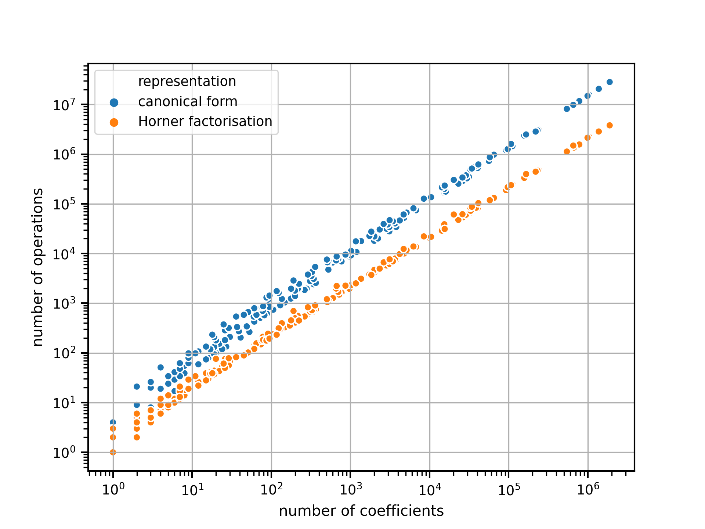

# Abstract

Many applications in the sciences require numerically stable and computationally efficient evaluation of multivariate polynomials.
Finding beneficial representations of polynomials, such as Horner factorisations, is therefore crucial.
`multivar_horner` [@github], the Python package presented here, is, as far as we are aware, the first open-source software for computing multivariate Horner factorisations.
This paper briefly outlines the functionality of the package and places it in context with respect to previous work in the field.
Benchmarks additionally demonstrate the advantages of the implementation and Horner factorisations in general.


# Introduction

Polynomials are a central concept in mathematics and find application in a wide range of fields [@prasolov2009polynomials; @boumova2002applications; @cools2002advances; @akritas1989elements; @Hecht1].
(Multivariate) polynomials have different possible mathematical representations and the beneficial properties of some representations are in great demand in many applications [@LeeFactorization2013; @leiserson2010efficient; @Hecht1].

The *Horner factorisation* is such a representation with beneficial properties.
Compared to the unfactorised representation of a multivariate polynomial, in the following called *canonical form*, this representation offers some important advantages.
Firstly, the Horner factorisation is more compact, in the sense that it requires fewer mathematical operations in order to evaluate the polynomial (cf. \autoref{fig:num_ops_growth}).
Consequently, evaluating a multivariate polynomial in Horner factorisation is faster and numerically more stable [@pena2000multivariate; @pena2000multivariate2; @greedyHorner] (cf. \autoref{fig:num_err_growth}).
These advantages come at the cost of an initial computational effort required to find the factorisation.

The `multivar_horner` Python package implements a multivariate Horner scheme ("Horner's method", "Horner's rule") [@horner1819xxi] to compute Horner factorisations of multivariate polynomials given in canonical form.
The package offers the functionality of representing multivariate polynomials of arbitrary degree in Horner factorisation as well as in canonical form.
Additionally it allows to compute the partial derivatives of a polynomial and to evaluate a polynomial at a given point.
Accordingly the package presented here is useful whenever (multivariate) polynomials have to be evaluated efficiently, the numerical error of the polynomial evaluation has to be small, or a compact representation of the polynomial is required.
This holds true for many applications applying numerical analysis.
One example use case where this package is already being employed are novel response surface methods [@michelfeitresponse] based on multivariate Newton interpolation [@Hecht1].


# Functionality

`multivar_horner` implements a multivariate Horner scheme using the greedy heuristic presented in [@greedyHorner].
In the following the key functionality of this package is outlined.
For more details on polynomials and Horner factorisations please refer to the literature, e.g. [@neumaier2001introduction].

A polynomial in canonical form is a sum of monomials.
For a univariate polynomial $f(x) = a_0 + a_1 x + a_2 x^2 + \cdots + a_d x^d$ (canonical form), the Horner factorisation is unique: $f(x) = a_0 + x ( a_1 + x( \cdots x (a_d) \cdots )$.
In the multivariate case, however, the factorisation is ambiguous, as there are multiple possible factors to factorise with.
The key functionality of `multivar_horner` is finding a good instance among the many possible Horner factorisations of a multivariate polynomial.

Let's consider the example multivariate polynomial given in canonical form by $p(x) = 5 + x_1^3 x_2 + 2 x_1^2 x_3 + 3 x_1 x_2 x_3$.
The polynomial $p$ is the sum of $4$ monomials, has dimensionality $3$ and can also be written as $p(x) = 5 x_1^0 x_2^0 x_3^0 + 1 x_1^3 x_2^1 x_3^0 + 2 x_1^2 x_2^0 x_3^1 + 3 x_1^1 x_2^1 x_3^1$.
The coefficients of the monomials are $5$, $1$, $2$ and $3$ respectively.

From this formulation it is straightforward to represent a multivariate polynomial with a single vector of coefficients and one exponent matrix.
Due to its simplicity and universality this kind of representation is used for defining polynomials as input.
It should be noted that this most trivial representation is computationally expensive to evaluate.

The number of additions of a polynomial remains constant irrespective of the polynomial factorisation, since it depends solely on the number of monomials and a factorisation does not influence the number of monomials.
This holds true only without taking common subexpression elimination into account.
Hence the number of additions is irrelevant for evaluating the quality of a factorisation.
In the following we accordingly only count the number of multiplications for a less biased comparison to other polynomial representations.
Note that each exponentiation is counted as (exponent - 1) operations.

# Usage

The following code snippet shows how to use `multivar_horner` to compute a Horner factorisation of $p$:


```python
from multivar_horner import HornerMultivarPolynomial
coefficients = [5.0, 1.0, 2.0, 3.0]
exponents = [[0, 0, 0], [3, 1, 0], [2, 0, 1], [1, 1, 1]]
p = HornerMultivarPolynomial(coefficients, exponents, rectify_input=True,
	compute_representation=True)
````

The factorisation computed by `multivar_horner` is $p(x) =  x_1 (x_1 (x_1 (1 x_2) + 2 x_3) + 3 x_2 x_3) + 5$ and requires 7 multiplications for every polynomial evaluation.
The human readable representation of the polynomial can be accessed with:

```python
print(p.representation)
# [#ops=7] p(x) = x_1 (x_1 (x_1 (1.0 x_2) + 2.0 x_3) + 3.0 x_2 x_3) + 5.0
````

It should be noted that the implemented factorisation procedure is coefficient-agnostic and hence does not, for example, optimise multiplications with $1$.
This design choice has been made in order to have the ability to change the coefficients of a computed polynomial representation a posteriori.

With the default settings a Horner factorisation is computed by recursively factorising with respect to the factor most commonly used in all monomials.
When no leaves of the resulting binary "Horner factorisation tree" can be factorised any more, a "recipe" for evaluating the polynomial is  compiled.
This recipe encodes all operations required to evaluate the polynomial in `numpy` arrays [@numpy].
This enables the use of functions just-in-time compiled by `numba` [@numba], which allow the polynomial evaluation to be computationally efficient.
The just-in-time compiled functions are always used, since a pure-Python polynomial evaluation would to some extent outweigh the benefits of Horner factorisation representations.

`multivar_horner` allows to evaluate the polynomial $p$ at a point $x$:

```python
x = [-2.0, 3.0, 1.0]
p_x = p.eval(x, rectify_input=True) # -29.0
````


# Degrees of multivariate polynomials




In contrast to the one-dimensional case, there are several concepts of degree for polynomials in multiple dimensions.
Following the notation of [@trefethen2017multivariate] the usual notion of degree of a polynomial, the *total degree*, is the maximal sum of exponents of all monomials.
This is equal to the maximal $l_1$-norm of all exponent vectors of the monomials.
Accordingly the *euclidean degree* is the maximal $l_2$-norm and the *maximal degree* is the maximal $l_{\infty}$-norm of all exponent vectors.
Please refer to [@trefethen2017multivariate] for precise definitions.

A polynomial is called *fully occupied* with respect to a certain degree if all possible monomials having a smaller or equal degree are present.
The occupancy of a polynomial can then be defined as the number of monomials present, relative to the fully-occupied polynomial of this degree.
A fully-occupied polynomial hence has an occupancy of $1$.


The number of coefficients (equal to the number of possible monomials) in multiple dimensions highly depends on the type of degree a polynomial has (cf. \autoref{fig:num_coeff_growth}).
This effect intensifies as the dimensionality grows.


# Benchmarks




For benchmarking our method the following procedure is used:
In order to sample polynomials with uniformly random occupancy, the probability of monomials being present is picked randomly.
For a fixed *maximal* degree $n$ in $m$ dimensions there are $(n+1)^m$ possible exponent vectors corresponding to monomials.
Each of these monomials is included with the chosen probability.

Five polynomials were sampled randomly for each maximal degree up to 7 and dimensionality up to 7.
In order to compute the numerical error, each polynomial is evaluated at a point sampled uniformly from $[-1; 1]^m$ with the different methods.
The polynomial evaluation algorithms use 64-bit floating point numbers, whereas the ground truth is computed with 128-bit accuracy in order to avoid numerical errors in the ground truth value.
To obtain more representative results, the numerical error is averaged over 100 runs with uniformly-random coefficients each in the range $[-1; 1]$.
All errors are displayed relative to the ground truth.



Note that even though the original monomials are not actually present in a Horner factorisation, the number of coefficients is nonetheless identical to the number of coefficients of its canonical form.
With increasing size in terms of the number of included coefficients, the numerical error of both the canonical form and the Horner factorisation found by `multivar_horner` grow exponentially (cf. \autoref{fig:num_err_growth}).
However, in comparison to the canonical form, the Horner factorisation is more numerically stable, as visualised in \autoref{fig:num_err_heatmap}.
The numerical stability of Horner factorisations has theoretically been shown in [@greedyHorner; @pena2000multivariate; @pena2000multivariate2].

Even though the number of operations required for evaluating the polynomials grows exponentially with their size, irrespective of the considered representation, \autoref{fig:num_ops_growth} shows that the rate of growth is lower for the Horner factorisation.
As a result, the Horner factorisations are computationally easier to evaluate.



# Related work

This package has been created due to the recent advances in multivariate polynomial interpolation [@Hecht1; @Hecht2].
High-dimensional interpolants of large degrees create the demand for evaluating multivariate polynomials in a computationally efficient and numerically stable way.
These advances enable modeling the behaviour of (physical) systems with polynomials.
Obtaining an analytical, multidimensional and nonlinear representation of a system opens up many possibilities.
With so-called "interpolation response surface methods" [@michelfeitresponse], for example, a system can be analysed and optimised.


The commercial software [`Maple`](https://www.maplesoft.com/support/help/Maple/view.aspx?path=convert%2Fhorner) offers the ability to compute multivariate Horner factorisations. However `multivar_horner` is, as far as we are aware, the first open-source implementation of a multivariate Horner scheme.
The `Wolfram Mathematica` framework supports [univariate Horner factorisations](https://reference.wolfram.com/language/ref/HornerForm.html).
The `Julia` package [StaticPolynomials](https://github.com/JuliaAlgebra/StaticPolynomials.jl) has a functionality similar to `multivar_horner`, but does not support computing Horner factorisations.


[`NumPy`](https://numpy.org/doc/stable/reference/routines.polynomials.polynomial.html) [@numpy] offers functionality to represent and manipulate polynomials of dimensionality up to 3.
`SymPy` offers the dedicated module [`sympy.polys`](https://docs.sympy.org/latest/modules/polys/index.html) for symbolically operating with polynomials.
As stated in the [documentation](https://mattpap.github.io/masters-thesis/html/src/algorithms.html#evaluation-of-polynomials), `SymPy` does not use Horner factorisations for polynomial evaluation in the multivariate case.
[`Sage`](https://doc.sagemath.org/html/en/reference/polynomial_rings/index.html) covers the algebraic side of polynomials.

`multivar_horner` has no functions to directly interoperate with other software packages.
The generality of the required input parameters (coefficients and exponents), however, still ensures the compatibility with other approaches.
It is, for example, easy to manipulate a polynomial with other libraries and then compute the Horner factorisation representation of the resulting output polynomial with `multivar_horner` afterwards, by simply transferring coefficients and exponents.
Some intermediate operations to convert the parameters into the required format might be necessary.


# Further reading

The documentation of the package is hosted on [readthedocs.io](https://multivar_horner.readthedocs.io/en/latest/).
Any bugs or feature requests can be filed on [GitHub](https://github.com/MrMinimal64/multivar_horner/issues) [@github].
The [contribution guidelines](https://github.com/MrMinimal64/multivar_horner/blob/master/CONTRIBUTING.rst) can be found there as well.

The underlying basic mathematical concepts are explained in numerical analysis textbooks like [@neumaier2001introduction].
The Horner scheme at the core of `multivar_horner` has been theoretically outlined in [@greedyHorner].

Instead of using a heuristic to choose the next factor, one could instead search over all possible Horner factorisations in order to arrive at a minimal factorisation.
The number of possible factorisations, however, increases exponentially with the degree and dimensionality of a polynomial (number of monomials).
One possibility to avoid computing each factorisation is to employ a version of A-star search [@hart1968formal] adapted for factorisation trees.
`multivar_horner` also implements this approach, which is similar to the branch-and-bound method suggested in [@kojima2008efficient, ch. 3.1].

[@carnicer1990evaluation] shows how factorisation trees can be used to evaluate multivariate polynomials and their derivatives.
In [@kuipers2013improving] Monte Carlo tree search has been used to find more performant factorisations than with greedy heuristics.
Other beneficial representations of polynomials are specified, for example, in [@LeeFactorization2013] and [@leiserson2010efficient].


# Acknowledgements

Thanks to Michael Hecht (Max Planck Institute of Molecular Cell Biology and Genetics) and Steve Schmerler (Helmholtz-Zentrum Dresden-Rossendorf) for valuable input enabling this publication.
I also thank the editor David P. Sanders (Universidad Nacional Autónoma de México) as well as the reviewers Henrik Barthels (RWTH Aachen University) and Sascha Timme (TU Berlin) for their helpful feedback.


# References
